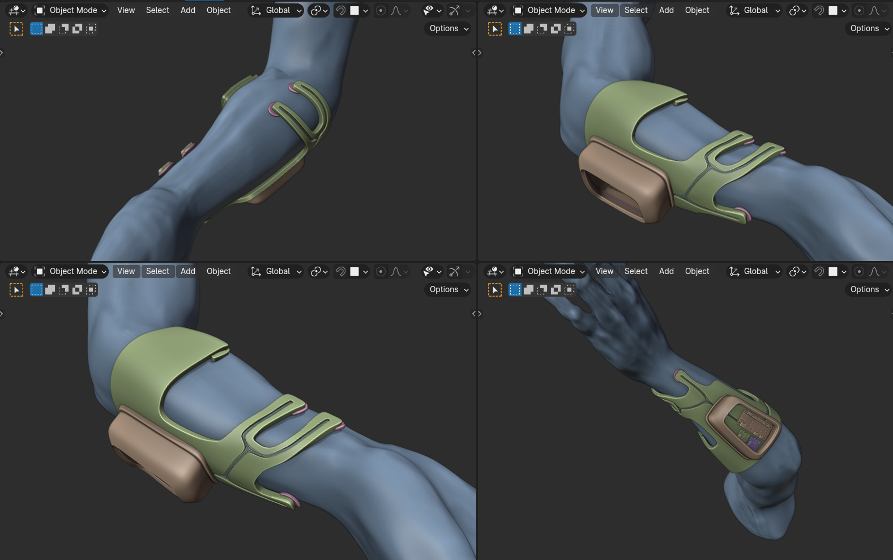

# Enabling Communication for Paralyzed Individuals through EMG-based Speech Synthesis

## Problem Statement:
The problem we aim to address is the communication challenges faced by paralyzed individuals in the healthcare sector. Many paralyzed individuals find it difficult to express their thoughts and needs verbally, leading to a diminished quality of life. In Sri Lanka, the attention given to developing solutions for the disabilities of paralyzed individuals has been limited.

## Solution Overview:
Our solution involves the creation of a device that processes EMG signals from paralyzed individuals to decode their neural impulses. Trained machine learning models, using datasets of neural impulses, generate rough sentences based on the patient's intent. Subsequently, a Language Model (LLM) refines these sentences for precise communication. The output is then transmitted through a Text-To-Speech (TTS) Model to the listener.

## Methodology:

### 1. Signal Processing:
EEG or EMG signals are processed to extract relevant neural impulses.

### 2. ML Decoding:
Trained ML models decode neural impulses into control signals, which can be used to control keyboard splitting system.

### 3. LLM Refinement:
Language models refine rough sentences for precise communication.

### 4. Audio Transmission:
Processed sentences are transmitted through speakers by TTS.

## Contributing:
We welcome contributions from developers, researchers, and healthcare professionals. If you're interested in contributing to this project, please fork the repository and submit a pull request.
